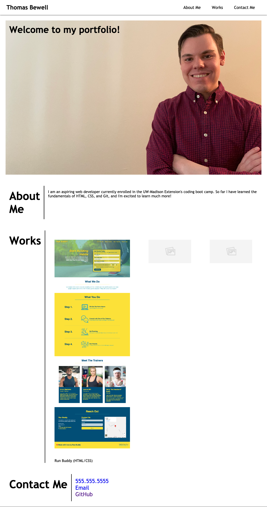

# Challenge 2 Professional Portfolio

## Purpose
This is my second challenge assignment for my coding boot camp. For it I have built a profesional portfolio using HTML and CSS.

## Website 
[Link to deployed application](https://thomasbewell.github.io/professional-portfolio/ "Link to Professional Portfolio")

## Screenshot
